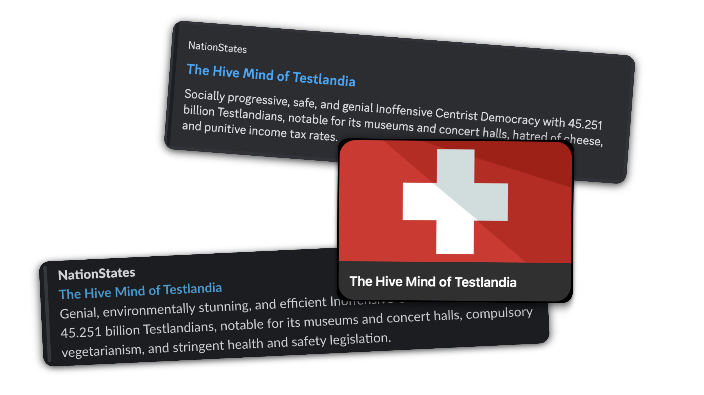

# FxNS

Share links with rich embeds to your NationStates nation on Discord, Messenger, and more.

Inspired by (but unaffiliated with) [FxTwitter](https://github.com/FixTweet/FxTwitter).

## How to use

Just replace `nationstates.net` in your nation URLs with `fxns.pronoun.workers.dev`! For example, check out [fxns.pronoun.workers.dev/testlandia](https://fxns.pronoun.workers.dev/testlandia) or [fxns.pronoun.workers.dev/nation=testlandia](https://fxns.pronoun.workers.dev/nation=testlandia).

## License

[MIT](./LICENSE)
